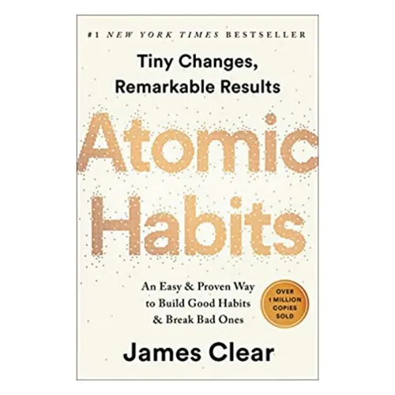
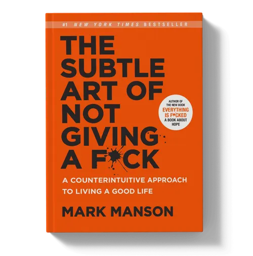
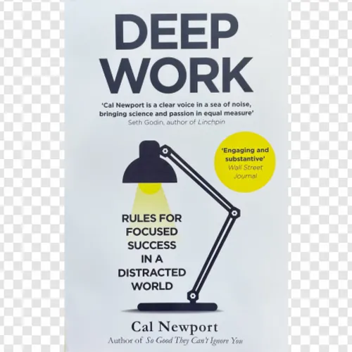
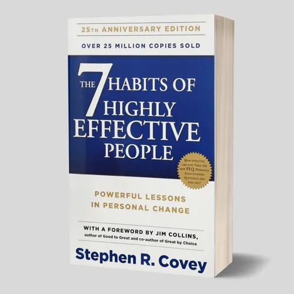
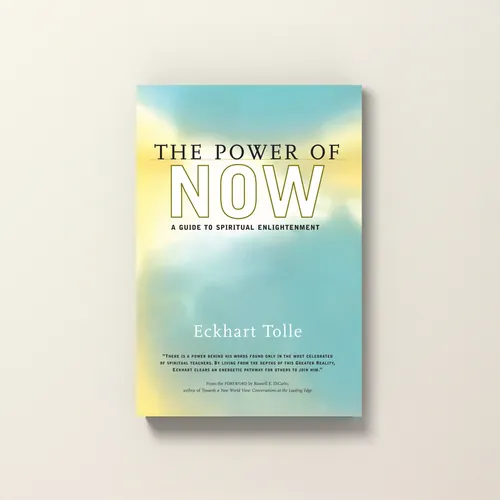

# Week 01 — Success Mindset (Mindset OS)

Part of the DevOps Micro Internship (DMI) Cohort 3 with Agentic AI

---

## Purpose (Read This First)

This week is not motivation homework.

This is you building your **Mindset OS** — the system you will use for the next 5 months (and honestly, for years).

### Expectations

* Be honest.
* Be specific.
* Be practical.
* Write like an adult professional: clear sentences, no one-liners.

You will reuse this in later weeks. So do it properly once.

---

# Assignment 1. What is something you believe to be true that most people around you would disagree with?

### Rules

* No "safe" answers.
* Must be your real belief (not copied from internet).
* Minimum 50 words.

**Hint:** What do you believe about career, money, learning, discipline, relationships, health, success, life, tech industry, etc. that most people don't agree with?

## Answer

I believe being busy does not always mean being productive. Many people around me think that studying or working for long hours automatically leads to better results. I disagree with that I think focused work, consistency, and actually understanding what you are doing matter more than simply spending more hours. Someone who learns deeply for two focused hours can sometimes achieve more than someone who spends eight hours working without a clear goal.

---

# Assignment 2. What are the top 3 objective truths you discovered through experimentation and results?

### Definition

Objective truths do not depend on opinions. They hold true regardless of how people feel.

Write each truth in this format:

**Truth:** (1 sentence)

**Evidence from my life:** (2–4 lines: what you tried + what happened)

---

## Truth #1

### Truth

Consistent practice produces better results than studying only when i feel motivated.

### Evidence from my life

I noticed that when i followed a regular study routine, I understood and remembered concepts better. When i studied only when i felt motivated, my progress became inconsistent and i had to spend extra time revising the same topics.

---

## Truth #2

### Truth

Learning by actually doing something is more effective for me than only reading about it.

### Evidence from my life

While working on technical projects and assignments, I understood concepts more clearly when I implemented them myself. I also became better at identifying and fixing problems after experiencing them directly.

---

## Truth #3

### Truth

Breaking a difficult task into smaller steps makes it easier to complete.

### Evidence from my life

I have worked on technical assignments where the complete task initially seemed complicated. After dividing it into smaller tasks and completing them one by one, I was able to make steady progress without feeling overwhelmed.

---

# Assignment 3. What does your 2.0 version look like?

### Instructions

Write as if a journalist is writing about you **3 to 7 years from now** (not 20 years).

**Minimum 300 words.**

### Rules

* Write in past tense, like it already happened.
* Don't use "likes to / wants to / hopes to."
* Use specifics:

  * built
  * shipped
  * led
  * published
  * earned
  * relocated
  * contributed
* Include skills proof:

  * projects
  * portfolios
  * GitHub
  * blogs
  * certifications
  * job role
  * leadership
  * community contribution
* Add 1–3 images if you can (optional but powerful).

### Publish It Publicly On Any ONE

* LinkedIn
* Medium
* WordPress
* Blogspot
* Personal blog
* Portfolio page

Use the credit note that matches your track:

Add the following credit note at the end of your post **(If you are DMI Cohort 3 student)**:

> **P.S. This post is part of the DevOps Micro Internship (DMI) with Agentic AI — Cohort 3 — by [Pravin Mishra](https://www.linkedin.com/in/pravin-mishra-aws-trainer/). My graded progress is public: https://dmi.pravinmishra.com/s/YOUR-GITHUB-USERNAME.html · Start your DevOps journey: https://dmi.pravinmishra.com/?utm_source=student&utm_medium=ps-blog&utm_campaign=cohort3**

Add the following credit note at the end of your post **(If you are DMI Self-paced track student)**:

> **P.S. This post is part of the DevOps Micro Internship (DMI) — Self-Paced Engineer Track — by [Pravin Mishra](https://www.linkedin.com/in/pravin-mishra-aws-trainer/). My graded progress is public: https://dmi.pravinmishra.com/s/YOUR-GITHUB-USERNAME.html · Start your DevOps journey: https://dmi.pravinmishra.com/?utm_source=student&utm_medium=ps-blog&utm_campaign=self-paced**

Add the following credit note at the end of your post **(If you are DMI Campus student)**:

> **P.S. This post is part of the DevOps Micro Internship (DMI) — Campus — by [Pravin Mishra](https://www.linkedin.com/in/pravin-mishra-aws-trainer/). My graded progress is public: https://dmi.pravinmishra.com/s/YOUR-GITHUB-USERNAME.html · Start your DevOps journey: https://dmi.pravinmishra.com/?utm_source=student&utm_medium=ps-blog&utm_campaign=campus**

## Your Article

What Does My 2.0 Version Look Like?

Nikhil Kumar Yadav graduated from Durgapur Institute of Advanced Technology and Management in 2027, technically as a Computer Science student, though by then most people around him just called him "the security guy."

That reputation came from two internships that didn't look like much on paper. At Future Interns he found a SQL injection in a deliberately broken practice app — the kind of bug every security student eventually finds — and then, mostly out of curiosity, built his own encrypted file-sharing tool with Flask and AES-256 to see the problem from the other side. At Codec Technologies a few months later, he spent most of his time not hunting for bugs but writing reports about the ones he'd found, and he later said that was the part that actually taught him something: getting someone else to care enough to fix a problem is harder than finding it in the first place.

He picked up the IBM Cybersecurity Analyst Professional Certificate that same year, and kept adding certifications after that in digital forensics, cybersecurity architecture, fraud prevention — partly for the resume, partly because he genuinely liked doing it. He entered two CTFs, CyberGeek'26 and HackZero'26, and placed respectably in both, top third or so, nothing to brag about but enough to keep him coming back.

The shift toward DevOps started almost by accident, through a DMI Campus micro-internship built around agentic AI, where he got his first real hands-on time with Docker, Kubernetes, and Terraform. A few weeks after that he built ARIES, a small platform that pulled security data from a few different sources into one place and flagged things a fixed rulebook would've missed. It wasn't a huge project, but he put it on GitHub, and it ended up being the thing interviewers kept asking him about.

By 2028 he'd relocated to Bangalore for a security and DevOps role, contributed a couple of small fixes to open-source tools, and started writing occasional breakdowns on his own site that a few other students actually read.

All thanks to DMI campus by Pravin Mishra makes me realize this.

hashtag#DMIByPravinMishra hashtag#AgenticAI hashtag#DevOps 

P.S. This post is part of the DevOps Micro Internship (DMI) — Self-Paced Engineer Track — by [Pravin Mishra](https://www.linkedin.com/in/pravin-mishra-aws-trainer/). My graded progress is public: https://lnkd.in/gmz6gzxW · Start your DevOps journey: https://lnkd.in/gArdpASa

---

### Public Link

Paste your link here:

`https://www.linkedin.com/posts/nikhil-kumar-yadav-b6a48a21b_dmi-devops-micro-internship-with-agentic-activity-7506953224025878528-4OO0`---

# Assignment 4. Have you ever cut corners (unethical / dishonest / shortcut behavior — not necessarily illegal)? If yes, how did it make you feel?

### Important

You don't need to write the full story.

Focus on the feeling:

* guilt
* fear
* shame
* stress
* regret
* numbness
* etc.

This is about self-awareness, not judgment.

### Answer Format

**Yes / No**

If Yes:

**What emotion did you feel?** (minimum 50–100 words)

## Answer

Yes.

I have taken shortcuts before when I knew I should have put in more effort. At first, it felt convenient because I could finish the task quickly, but afterward I felt guilty and stressed because I knew the result did not fully represent my own effort. I also worried about being caught or having to explain something I had not properly understood. It made me realize that shortcuts may save time temporarily, but they can reduce confidence and create unnecessary stress later.

---

# Assignment 5. What are 10 non-fiction books you plan to read in the next 1 year?

### Rules

* Mention **Title + Author**
* Any language allowed
* No fiction novels

### Tip

Choose books that improve:

* mindset
* communication
* productivity
* health
* money
* career
* leadership

## Book List

1. Rich Dad Poor Dad — Robert Kiyosaki

2. Atomic Habits — James Clear

3. The Subtle Art of Not Giving a F*ck — Mark Manson

4. Ikigai — Héctor García & Francesc Miralles

5. The Psychology of Money — Morgan Housel

6. How to Win Friends and Influence People — Dale Carnegie

7. Deep Work — Cal Newport

8. The 7 Habits of Highly Effective People — Stephen R. Covey

9. The Power of Now — Eckhart Tolle

10.Think and Grow Rich — Napoleon Hill

---

# Assignment 6. What are the things you will measure regularly in your life and career?

### Rules

List topics only. No need to share numbers.

### Must Include

* Learning / skill
* Output / proof
* Health / energy
* Time / focus
* Money / finance (personal or business)

### Example

* Learning hours per week
* Deep work sessions per week
* Projects shipped / documented
* Steps / workouts
* Sleep hours
* Spending tracker

## My Metrics

* Learning hours per week
* New skills or concepts learned
* Projects completed and documented
* GitHub contributions and project updates
* Deep work / focused study sessions
* Daily screen time and distractions
* Workout sessions per week
* Sleep duration and energy levels
* Monthly spending and savings
* Career applications, interviews, and professional progress
---

# Assignment 7. Brain Dump + 5-Month System Plan

## Step 1: Brain Dump (Private)

Do a brain dump of everything in your mind into a notebook.

Examples:

* Bills
* Tasks
* Worries
* Goals
* Pending messages
* Ideas
* Responsibilities

### Did You Do It?

**Yes / No**

Answer:

Yes

---

## Step 2: Your 5-Month Routine + Focus Blocks

Create a simple plan you can realistically follow for the next 5 months.

### Weekly Routine

Example:

* Mon–Thu: 60 min deep work
* Sat: DMI session
* Sun: Weekly review

#### My Weekly Routine

* Mon–Fri: 1–2 hours of focused study and skill development
* Mon–Thu: Cybersecurity / DevOps learning and practical work
* Friday: Project work and GitHub updates
* Saturday: DMI assignments and practical tasks
* Sunday: Weekly review, revision, and planning for the next week

---

### Focus Blocks

#### When Will You Do DMI Work? (Days + Time)

* Saturday: 10:00 AM – 12:00 PM
* Sunday: 10:00 AM – 11:00 AM

#### How Many Sessions Per Week?

* 2 sessions per week.

---

### Distraction Rules

Examples:

* Phone rules
* Social media rules
* Environment setup

#### My Distraction Rules

* Keep my phone away during focused study sessions
* Avoid unnecessary social media while studying
* Use only the required tabs and applications during DMI work
* Complete one task before starting another
* Take short breaks instead of switching to entertainment
* Keep my study environment clean and organized

---

# Reflection – Week 1

### Biggest insight I got about myself this week

I realized that I can make consistent progress when I have a clear plan and break larger goals into smaller tasks. I also learned that having a routine helps me stay focused instead of depending only on motivation.

### My biggest weakness/loop I noticed

My biggest weakness is sometimes getting distracted by my phone and spending too much time on small things instead of completing the important task first.

### One system I will implement from this week (exact habit + time)

I will follow a 60-minute focused work session every evening from 7:00 PM to 8:00 PM, keeping my phone away and working on only one important learning or career task.

### LinkedIn Post

Paste your LinkedIn post link here:

`https://www.linkedin.com/posts/nikhil-kumar-yadav-b6a48a21b_dmi-devops-micro-internship-with-agentic-activity-7506659579037065216-fKZUT`

---

## 10. Proof of Work

- LinkedIn Post URL: **[Nikhil Kumar Yadav Linkedin](https://www.linkedin.com/posts/nikhil-kumar-yadav-b6a48a21b_dmi-devops-micro-internship-with-agentic-activity-7506659579037065216-fKZU)**  
- Blog / Medium : **[Nikhil Kumar Yadav Blog](https://medium.com/@nikhilky1235/how-a-cybersecurity-fresher-built-his-way-into-devops-one-certificate-at-a-time-d719242b3de7?sharedUserId=nikhilky1235)**  

---

## 📌 About DMI & CloudAdvisory

DevOps Micro Internship (DMI) is a project-based DevOps program run by Pravin Mishra (The CloudAdvisory) focused on real-world execution, systems thinking, and career readiness.

It helps learners build strong DevOps foundations with hands-on experience.

## 📌 Resources

- 🌐 **DMI Official Website:** https://dmi.pravinmishra.com?utm_source=github&utm_medium=readme  
- 🎓 **University:** https://university.pravinmishra.com?utm_source=github&utm_medium=readme  
- 💬 **Discord Community:** https://discord.pravinmishra.com?utm_source=github&utm_medium=readme  
- 📝 **Blog:** https://dmi.pravinmishra.com/blog?utm_source=github&utm_medium=readme  
- ▶️ **YouTube Playlist (DMI Cohort 3):** https://www.youtube.com/playlist?list=PLFeSNDtI4Cho  
- 🔗 **Pravin Mishra (LinkedIn):** https://www.linkedin.com/in/pravin-mishra-aws-trainer/  
- 🏢 **CloudAdvisory (LinkedIn):** https://www.linkedin.com/company/thecloudadvisory/

---

*This submission is part of DevOps Micro Internship (DMI) Cohort 3 — Agentic AI Track*